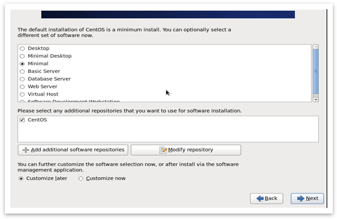
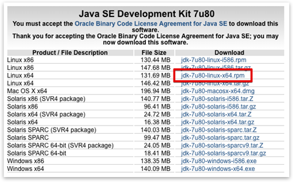
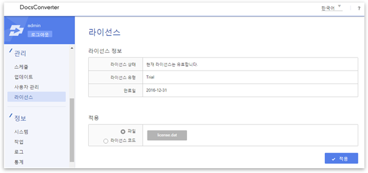

# DocsConverter Installation Guide for Linux
  * 2016. 06
  * ㈜한글과컴퓨터


## 사전 요구사항
시작하기 전에 다음과 같은 설치환경 및 파일들이 준비되어 있어야 합니다.
   1. CentOS 6.x 64bit
   2. DocsConverter 인스톨러 : hermes-7.0.0.x-installer-version-linux64.zip
   3. DocsConverter 라이선스 파일 : license.dat
   4. Oracle JDK : Oracle JDK-7u80 (jdk-7u80-linux-x64.rpm)
   5. Package: ImageMagick, Cairo

### 설명
DocsConverter는 JDK를 필요로 합니다. 
DocsConverter를 설치하면서 제어 서버로 ‘Tomcat’, 변환 프로세서로 ‘Processing’을 시스템 서비스로 등록하게 됩니다.

### 지원 운영체제
아래와 같은 운영체제를 지원합니다.
  - CentOS Linux 6.6 64bit (권장)
  - Debian SID 64bit

본 설명서에서는 CentOS 6.x의 최신버전이 설치되어 있으며 yum 명령어를 통한 패키지 업데이트가 가능하다고 가정합니다.



### 데이터베이스
다음과 같은 DBMS를 지원하며, 기본적으로 PostgreSQL DBMS 사용을 권장합니다.
   - Derby (http://db.apache.org/derby/)
   - PostgreSQL (http://www.postgresql.org/)
   - MySQL (http://www.mysql.com/)
   - Oracle (http://www.oracle.com/index.html)
   - MSSQL (http://www.microsoft.com/sqlserver/en/us/default.aspx)

## DocsConverter 설치
CentOS 6.6에서의 DocsConverter 빠른 설치 과정을 설명합니다. 설치를 성공적으로 수행하고 나면 DocsConverter를 사용하여 문서 파일들을 이미지, HTML, PDF와 같은 다른 형식으로 변환할 수 있습니다.

### 글꼴 및 Sun JDK 설치

먼저 JDK를 설치해야 합니다. (버전 1.7 이상) http://java.oracle.com 을 방문하여 다운로드합니다.


 
다운로드 후, 서버에 root 계정으로 로그인하여 아래와 같은 과정으로 JDK를 설치합니다.

* yum 업데이트 및 글꼴 파일 설치
```
[root@hdcs src]# yum update
[root@hdcs src]# cat /etc/redhat-release
CentOS release 6.5 (Final)
[root@hdcs src]# yum install kde-i18n-Korean fonts-korean   
[root@hdcs src]# yum install unzip
[root@hdcs src]# fc-cache -fv
```

* Oracle JDK 설치
```
[root@hdcs src]# ls -a
.  ..  installer-version-linux64.zip  jdk1.7.0_45  jdk-6u45-linux-x64.bin
[root@hdcs src]#.rpm -ivh jdk-7u45-linux-x64.rpm
Preparing...                #################################### [100%]
   1:jdk                    ##################################### [100%]
Unpacking JAR files...
     rt.jar...
     jsse.jar...
     charsets.jar...
     tools.jar...
     localedata.jar...
     jfxrt.jar...
[root@hdcs src]# alternatives --install /usr/bin/java java /usr/java/latest/bin/java 20000
[root@hdcs src]# alternatives --config java

There is 1 program that provides 'java'.

  Selection    Command
-----------------------------------------------
*+ 1           /usr/lib/jvm/jre-1.7.0-openjdk.x86_64/bin/java

Enter to keep the current selection[+], or type selection number: 1
[root@hdcs src]# java -version
java version "1.7.0_45"
Java(TM) SE Runtime Environment (build 1.7.0_45-b18)
Java HotSpot(TM) 64-Bit Server VM (build 24.45-b08, mixed mode)
[root@hdcs src]#
```

* Oracle 설치에 관한 상세한 설명은 다음 URL을 참고하시기 바랍니다. http://www.oracle.com/technetwork/java/javase/index-137561.html

### DocsConverter 설치
인스톨러 파일을 업로드한 후, 적당한 위치에 압축을 풀어주고 서버에서 해당 디렉토리로 이동합니다. 이후 “startup-console.sh”를 실행하여 인스톨러를 시작합니다. 이 때 가급적 root 권한으로 실행할 것을 권장합니다. 적절한 권한이 없을 경우 설치 과정에서 문제가 발생할 수 있습니다.

설치 과정에서 각종 설치 옵션 및 데이터베이스 시스템을 선택할 수 있습니다. 아래에 보이는 것과 같이 값을 입력합니다. 예제에서는 1개의 프로세싱 서비스를 8880 포트에서 구동하는 것으로 가정합니다.

DocsConverter는 이미지-이미지 및 PDF-이미지 필터 지원을 위해 ImageMagick, ghostscript, xpdf, swftools 등의 오픈소스 프로젝트들을 사용합니다. 해당 패키지들은 DocsConverter 설치 과정 중에 함께 설치됩니다.

[예제: 설치 과정] 
```
[root@hdcs src]# [root@hdcs src]# unzip installer-version-linux64.zip
[root@hdcs src]# cd installer
[root@hdcs installer]# ls -a
.  ..  hermes-install-6.0.jar  hncfilter  hword  installData.zip  lib  
LICENSE  startup-console.sh  startup-gui.sh  tfo  uninstall.sh
 [root@hdcs installer]#
[root@hdcs installer]# chmod +x *.sh
[root@hdcs installer]# ./startup-console.sh
starting HDCS Installer ...

* Select language for the installation. [ English(en), Korean(ko) ]:ko

--------------------------------------------------------------------------------------------------

* DocsConverter는 JDK 1.7 이상을 필요로 합니다.
* Derby를 제외한 다른 DB를 사용하려는 경우, 데이터베이스와 사용자는 미리 생성되어 있어야 합니다.
* 본 프로그램을 통하여 제어서버(Hermes)와 프로세싱서버(Processing)를 설치할 수 있습니다.
* 패키지 관리자를 이용한 설치가 필요한 경우, 요구되는 패키지를 다운받기 위해 네트워크 연결이 요구됩니다.

--------------------------------------------------------------------------------------------------

* 인스톨 작업을 계속 진행하시겠습니까? [ 예(y), 아니오(n) ]y
구성 준비 중 ..

* 컴포넌트 구성 확인 중..
    # xorg-x11-server-Xvfb 설치 확인 중 .. : [ OK ]

* DocsConverter를 설치할 기본 경로는 /root/hancom/HDCS 입니다. 기본 경로를 사용하시겠습니까? [ 예(y), 아니오(n) ]:y

* DB 타입을 선택하십시오.
( Default 값은 Derby로 적용되며, Derby를 사용할 경우 관리자 화면 상의 문제가 발생할 수 있습니다. )
[ Default(1), PostgreSQL(2), Mysql(3), Oracle(4), Mssql(5) ]:1

* 제어서버의 데이터를 저장할 경로는 기본적으로 /root/hancom/HDCS/hermes/data 입니다.
기본값을 적용하시겠습니까? [ 예(y), 아니오(n) ]:y

* 프로세싱 서버의 기본 포트 번호는 8880 입니다. 기본 포트 번호를 사용하시겠습니까? [ 예(y), 아니오(n) ]:y

* DocsConverter를 서비스로 등록하여 백그라운드 모드로 수행할 수 있습니다. 서비스로 등록하시겠습니까? [ 예(y), 아니오(n) ]:y

제어서버 구성 정보
--------------------------------------------------------------------------------------------------
    dataDir: /root/hancom/HDCS/hermes/data
    db.driverClassName: org.apache.derby.jdbc.EmbeddedDriver
    db.type: derby
--------------------------------------------------------------------------------------------------

프로세싱 서버 구성 정보
--------------------------------------------------------------------------------------------------
    port: 8880
--------------------------------------------------------------------------------------------------

* 구성 정보 입력이 완료되었습니다. DocsConverter 설치를 시작하시겠습니까? [ 예(y), 아니오(n), 서버 정보 재입력(r) ]:y

[ 0% ] 인스톨 작업 준비 중 ..
    # 홈 디렉토리 설정 중 ..
    # 기존 데이터 삭제 중 ..
[ 3% ] 서버 설치 중 ..
    # 제어서버 데이터 생성 중 ..
    # 제어서버 구성정보 설정 중 ..
    # 프로세싱서버 데이터 생성 중 ..
    # 프로세싱서버 구성정보 설정 중 ..
    # 제어서버 서비스 등록 중 ..
    # 프로세싱서버 서비스 등록 중 ..
[ 9% ] hancomoffice-linux 데이터 생성 중 ..
exitValue:7
exitValue:0
[ 34% ] hncfilter 데이터 생성 중 ..
[ 59% ] tfo 데이터 생성 중 ..
[ 84% ] 기타 데이터 환경설정 중 ..
[ 87% ] 릴리즈 정보 동기화 중 ..
[ 93% ] 임시 데이터 삭제 중 ..
[ 100% ] 인스톨 완료 중 ..

DocsConverter 설치 작업이 성공적으로 완료되었습니다.
[root@hdcs installer]#
```

프로세스 목록을 확인하고자 할 경우 다음과 같이 타이핑하면 Tomcat 및 Processing 프로세스 상태가 출력됩니다.
```
[root@hdcs installer]# ps -ef | grep java
```

#### 라이선스 등록

라이선스 파일은 웹 브라우저를 통해 접속한 후 관리자 화면에서 등록할 수 있습니다.


기본 계정 및 비밀번호는 “admin/admin”입니다. 
서버에 접근하려면 iptables 설정을 변경하거나 제거해야 할 수도 있습니다.



로그인한 후, 상단 메뉴바에서 라이선스 탭을 선택하여 라이선스 파일을 적용합니다.

#### 변환 테스트

“변환테스트” 탭에서 변환 기능을 시험해 볼 수 있습니다. 필터를 선택한 후 “변환” 버튼을 클릭하면, 몇 초 뒤에 변환 결과가 하단에 나타납니다. 


각 변환 파라미터에 대한 상세한 설명은 화면 우측 최상단 API 가이드 문서 링크를 참조하시기 바랍니다.

## 서비스 관리
성공적으로 설치를 수행하고 나면, /etc/rc.d/init.d 디렉토리 아래에서 Hdcs-tomcat 및 Hdcs-processing 서비스를 확인할 수 있습니다. 해당 서비스들은 서버를 재부팅한 후 자동으로 실행됩니다.

```
[root@localhost hdcs]# service hdcs-tomcat status
hdcs-tomcat status: [RUNNING]

[root@localhost hdcs]# service hdcs-processing status
hdcs-processing status: [RUNNING]
```

### 기동
```
[root@localhost hdcs]# service hdcs-tomcat start
[root@localhost hdcs]# service hdcs-processing start
```

### 중지
```
[root@localhost hdcs]# service hdcs-tomcat stop
[root@localhost hdcs]# service hdcs-processing stop
```

### DocsConverter 제거
1. root 권한으로 uninstall.sh 파일을 실행합니다.
2. 아래와 같은 단계를 통해 제거 과정이 진행됩니다.
```
[root@localhost src]# ./uninstall.sh
starting HDCS Installer ...

* Do you want to delete HDCS? [ Yes(y), No(n) ]:y

        # Removing services ..
        # Removing data ..

HDCS_HOME=/root/hancom/test

        # Removing information fo home path ..


HDCS has been successfully removed.
```


## 참조

### DocsConverter 버전 확인 방법

DocsConverter 설치 과정에서 HDCS_HOME 디렉토리 아래에 HDCS_RELEASE.xml 파일이 생성됩니다. 해당 파일을 통해 HDCS 및 함께 설치된 패키지들의 버전 정보를 확인할 수 있습니다.

```
[root@localhost hdcs]# ls -a
.  ..  HDCS_RELEASE.xml  hermes  processing  tomcat
```

```
	<?xml version="1.0" encoding="UTF-8"?>
	<hdcs>
		<version>7.0.0.70</version>
		<install_date>2015-11-03 15:58:53</install_date>
		<component>
			<name>hermes</name>
			<version>7.0.0.70</version>
		</component>
		<component>
			<name>hncfilter</name>
			<version>9.20.0.574-1</version>
		</component>
		<component>

…
```


### 로그 파일

설치 과정은 hermes_install.log 파일에 기록됩니다. DocsConverter 설치 도중 문제가 발생할 경우, 원인을 파악하기 위하여 로그파일의 내용을 참고할 수 있습니다. 서버 프로세싱 로그는 hermes 및 processing 아래의 logs 디렉토리에 기록됩니다. 문제가 발생할 경우 해당 로그파일과 함께 기술지원을 요청하시기 바랍니다.

```
[root@hdcs logs]# ll /root/hancom/HDCS/hermes/logs
total 164
-rw-r--r--. 1 root root 167331 Sep 18 13:53 hermes.log
[root@hdcs logs]# ll /root/hancom/HDCS/processing/logs
total 8
-rw-r--r--. 1 root root 7056 Sep 18 13:53 processor.log
[root@hdcs logs]# ll /root/hancom/HDCS/tomcat/logs
total 12
-rw-r--r--. 1 root root 2846 Sep 18 13:21 catalina.2015-09-18.log
-rw-r--r--. 1 root root 2846 Sep 18 13:21 catalina.out
-rw-r--r--. 1 root root    0 Sep 18 13:21 host-manager.2015-09-18.log
-rw-r--r--. 1 root root  485 Sep 18 13:21 localhost.2015-09-18.log
-rw-r--r--. 1 root root    0 Sep 18 13:21 manager.2015-09-18.log
[root@hdcs logs]#
```

### 네트워크 설정 – 방화벽 확인

리눅스 운영체제에 DocsConverter를 설치할 경우, 패키지 의존성을 만족시키기 위해 yum 또는 apt-get과 같은 패키지 관리자를 사용합니다. 서버의 네트워크 설정에 문제가 있거나 서버가 인터넷에 연결되어 있지 않은 경우, 패키지 관리자가 DocsConverter 설치에 필요한 패키지를 다운로드할 수 없습니다. 설치가 원활하지 않은 경우, DocsConverter 설치를 시작하기 전에 방화벽과 네트워크 연결이 올바르게 작동하는지 확인하시기 바랍니다.
