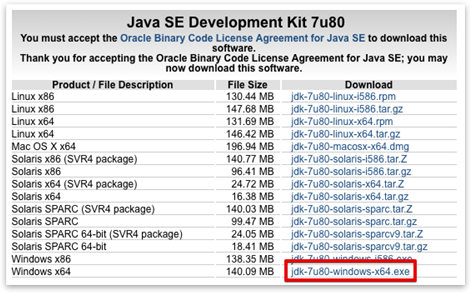
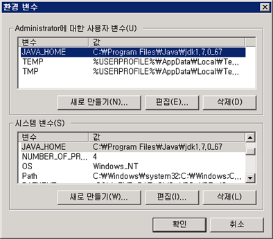
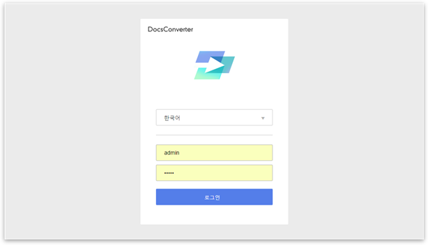
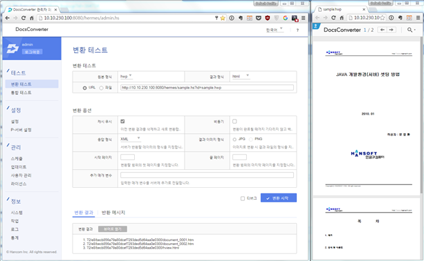
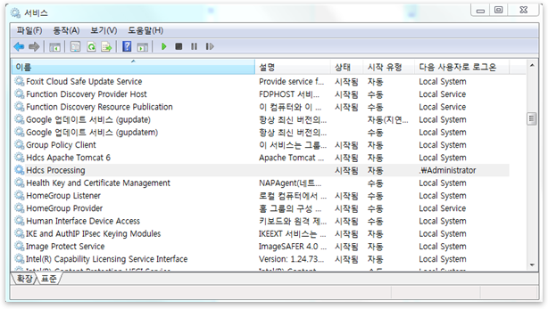
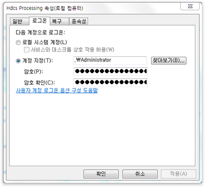

# DocsConverter Installation Guide for Windows
* 2016. 06
* ㈜한글과컴퓨터


## 사전 요구사항
시작하기 전에 다음과 같은 설치환경 및 파일들이 준비되어 있어야 합니다.
* Windows 32bit/64bit
* Microsoft .NET Framework 4.x
* Visual Studio 2013 Redistributable Packages (32bit and 64bit)
* DocsConverter 인스톨러 : hermes-7.0.0.x-installer-version-win64.zip
* DocsConverter 라이선스 파일 : license.dat
* Oracle JDK : Oracle JDK-7u80 (jdk-7u80-windows-x64.exe)
이하 내용은 DocsConverter 7.0.0.x 버전 기준입니다.

### 설명
DocsConverter는 JDK를 필요로 합니다. 
DocsConverter를 설치하면서 제어 서버로 ‘Tomcat’, 변환 프로세서로 ‘Processing’을 시스템 서비스로 등록하게 됩니다.

### 데이터베이스
다음과 같은 DBMS를 지원하며, 기본적으로 PostgreSQL DBMS 사용을 권장합니다.
* Derby (http://db.apache.org/derby/)
* PostgreSQL (http://www.postgresql.org/)
* MySQL (http://www.mysql.com/)
* Oracle (http://www.oracle.com/index.html)
* MSSQL (http://www.microsoft.com/sqlserver/en/us/default.aspx)

## DocsConverter 설치
Windows에서의 DocsConverter 빠른 설치 과정을 설명합니다. 설치를 성공적으로 수행하고 나면 DocsConverter를 사용하여 문서 파일들을 이미지, HTML, PDF와 같은 다른 형식으로 변환할 수 있습니다.

### .NET Framework 버전 확인
DocsConverter 는 .NET 4.0 이상 버전이 설치되어야 합니다. 버전이 낮은 경우 업데이트를 해야 합니다.

### JDK 설치
먼저 JDK를 설치해야 합니다. (버전 1.7 이상) http://java.oracle.com 을 방문하여 다운로드합니다.



설치 파일을 다운로드한 후, 서버에 JDK를 설치합니다.



설치 완료 후, JDK를 설치한 경로를 환경변수 JAVA_HOME 으로 등록합니다.


JDK 설치에 관한 상세한 설명은 다음 URL을 참고하시기 바랍니다.
http://www.oracle.com/technetwork/java/javase/index-137561.html


### DocsConverter 설치
인스톨러 파일을 업로드한 후, 적당한 위치에 압축을 풀어주고 서버에서 해당 디렉토리로 이동합니다. 이후 “startup-console.bat”를 실행하여 인스톨러를 시작합니다. 이 때 가급적 관리자 권한으로 실행할 것을 권장합니다. 적절한 권한이 없을 경우 설치 과정에서 문제가 발생할 수 있습니다.

설치 과정에서 각종 설치 옵션 및 데이터베이스 시스템을 선택할 수 있습니다. 아래에 보이는 것과 같이 값을 입력합니다. 예제에서는 1개의 프로세싱 서비스를 8880 포트에서 구동하는 것으로 가정합니다.

DocsConverter는 이미지-이미지 및 PDF-이미지 필터 지원을 위해 ImageMagick, ghostscript, xpdf, swftools 등의 오픈소스 프로젝트들을 사용합니다. 해당 패키지들은 DocsConverter 설치 과정 중에 함께 설치됩니다.

[예제: 설치 과정] 
```
starting HDCS Installer ...

* Select language for installation. [ English(en), Korean(ko) ]:ko

--------------------------------------------------------------------------------------------------

* DocsConverter 는 JDK1.7 이상을 필요로 합니다.
* Derby를 제외한 다른 DB를 사용하려는 경우, 데이터베이스와 사용자는 미리 생성되어 있어야 합니다.
* 본 프로그램을 통하여 제어서버(Hermes)와 프로세싱서버(Processing)를 설치할 수 있습니다.

--------------------------------------------------------------------------------------------------

* 인스톨 작업을 계속 진행하시겠습니까? [ 예(y), 아니오(n) ]:y
구성 준비 중 ..

* DocsConverter를 설치할 기본 경로는 C:\hancom\HDCS 입니다. 기본 경로를 사용하시겠습니까? [ 예(y), 아니오(n) ]:1

* DB 타입을 선택하십시오.
( Default 값은 Derby로 적용되며, Derby를 사용할 경우 관리자 화면 상의 문제가 발생할 수 있습니다. )
[ Default(1), PostgreSQL(2), Mysql(3), Oracle(4), Mssql(5) ]:1

* 제어서버의 데이터를 저장할 경로는 기본적으로 C:\hancom\HDCS\hermes\data입니다.
기본값을 적용하시겠습니까? [ 예(y), 아니오(n) ]:y

* 프로세싱 서버의 기본 포트 번호는 8880 입니다. 기본 포트 번호를 사용하시겠습니까? [ 예(y), 아니오(n) ]:y

* DocsConverter를 서비스로 등록하여 백그라운드 모드로 수행할 수 있습니다. 서비스로 등록하시겠습니까? [ 예(y), 아니오(n) ]:y

제어서버 구성 정보
--------------------------------------------------------------------------------------------------
        dataDir: C:\hancom\HDCS\hermes\data
        db.driverClassName: org.apache.derby.jdbc.EmbeddedDriver
        db.type: derby
--------------------------------------------------------------------------------------------------

프로세싱 서버 구성 정보
--------------------------------------------------------------------------------------------------
        port: 8880
--------------------------------------------------------------------------------------------------

* 구성 정보 입력이 완료되었습니다. HDCS 설치를 시작하시겠습니까? [ 예(y), 아니오(n), 서버 정보 재입력(r) ]:y

[ 0% ] 인스톨 작업 준비 중 ..
        # 홈 디렉토리 설정 중 ..
        # 기존 데이터 삭제 중 ..
[ 3% ] 서버 설치 중 ..
        # 제어서버 데이터 생성 중 ..
        # 제어서버 구성정보 설정 중 ..
        # 프로세싱서버 데이터 생성 중 ..
        # 프로세싱서버 구성정보 설정 중 ..
        # 제어서버 서비스 등록 중 ..
        # 프로세싱서버 서비스 등록 중 ..
[ 39% ] hncfilter 데이터 생성 중 ..
[ 67% ] tfo 데이터 생성 중 ..
[ 82% ] 기타 데이터 환경설정 중 ..
[ 85% ] 릴리즈 정보 동기화 중 ..
[ 92% ] 임시 데이터 삭제 중 ..
[ 100% ] 인스톨 완료 중 ..


DocsConverter의 정상적인 동작을 위하여, 시스템을 재부팅하십시오.
DocsConverter의 설치 작업이 성공적으로 완료되었습니다.
```

#### 라이선스 등록
라이선스 파일은 웹 브라우저를 통해 접속한 후 관리자 화면에서 등록할 수 있습니다.




기본 계정 및 비밀번호는 “admin/admin”입니다. 
서버에 접근하려면 iptables 설정을 변경하거나 제거해야 할 수도 있습니다.


로그인한 후, 상단 메뉴바에서 라이선스 탭을 선택하여 라이선스 파일을 적용합니다.

#### 변환 테스트

“변환테스트” 탭에서 변환 기능을 시험해 볼 수 있습니다. 필터를 선택한 후 “변환” 버튼을 클릭하면, 몇 초 뒤에 변환 결과가 하단에 나타납니다. 



각 변환 파라미터에 대한 상세한 설명은 화면 우측 최상단 API 가이드 문서 링크를 참조하시기 바랍니다.

#### 서비스 관리

DocsConverter 설치가 완료되고 나면, 서비스 메뉴에서 HDCS Apache Tomcat 및 HdcsProcessing 서비스를 확인할 수 있습니다. 해당 서비스들은 서버를 재부팅한 후 자동으로 실행됩니다.



HDCS Processing 서비스는 아래와 같이 관리자 권한을 가진 계정을 직접 지정을 해줘야 합니다.




## DocsConverter 제거
1. 관리자 권한으로 uninstall.bat 파일을 실행합니다.
2. 아래와 같은 단계를 통해 제거 과정이 진행됩니다.

```
* HDCS를 삭제하시겠습니까? [ 예(y), 아니오(n) ]:y

        # 서비스 삭제 중 ..
        # 레지스트리 삭제 중 ..
        # 데이터 삭제 중 ..

        # 홈 디렉토리 정보 삭제 중 ..
```
HDCS를 성공적으로 제거하였습니다.
