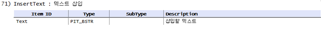

# 한글컨트롤 프로그래밍 이해와 활용
## 한글 컨트롤이란?


그림 1. 한글 컨트롤 사용 예

예를 들어 무한상사라는 회사에서 주마다 주간보고를 한다고 가정해봅니다. 위와 같은 서식을 사용하는 그룹웨어 시스템을 만든다면 어떤 기술요소를 이용해야 할까요? 그룹웨어 시스템이 구축되어 있지 않다면, 직원들은 주간 보고 양식 파일(hwp)를 열어 양식 파일 내에 내용을 기입하고 이를 이메일로 파일 첨부하여 상사에게 보고 할 것입니다. 이런 불편함을 줄이기 위해 그룹웨어 시스템을 개발한다면 간단한 HTML 태그들을 사용해서 위 양식을 만들고 DB와 연동하여 시스템을 만들 수 있을 겁니다. 하지만 이 경우 텍스트 기반이기에 서비스 품질이 많이 떨어집니다. 왜냐하면 그룹웨어 사용자가 위 그림처럼 그림을 첨부하거나 표를 만들거나 글자크기 수정 또는 도형들을 추가하고자 한다면 이런 기능들을 HTML 태그로 만드는 것은 불가능하기 때문입니다. 한글컨트롤을 사용하면 이러한 모든 불편사항이 사라집니다. 사용자는 자신의 데스크탑에서 한글 프로그램(hwp)으로 문서를 작성하는 것과 동일하게 작업을 할 수 있고, 간편하게 결과물을 게시판으로 게시하고 파일 서버 및 DB에 저장할 수 있습니다. 이처럼 한글 컨트롤은 한글 프로그램을 웹상에서 사용가능하게 함으로써 사용자 편리성과 산출물의 활용도를 크게 향상 시킬 수 있게 됩니다. 한글 컨트롤을 가장 단순하게 정의하면, 한글(hwp) ActiveX입니다. 즉, 한글 프로그램(hwp)을 웹에서 사용 가능하도록 ActiveX형태로 만든 것입니다. 이런 정의처럼 웹상에서 거의 모든 한글프로그램(hwp)의 기능을 사용할 수 있게 됩니다. HTML5, 프레임워크 개발 등의 신기술이 나오는 상황에서도 여전히 한글컨트롤은 신기술이 구현할 수 없는 편리성과 강력한 기능들을 한글 사용자에게 제공해 줄 수 있습니다.

## 객체기반 프로그래밍 vs 액션기반 프로그래밍

C++, Java 등의 프로그래밍 언어는 객체지향개념을 가지고 있다. 이는 비슷한 기능을 하는 요소들을 모아서 하나의 객체(또는 개체)로 정의하였다. 프로그래머는 자신이 원하는 기능을 구현하기 위해서 해당 기능이 포함된 객체 또는 클래스를 찾아서 이를 인스턴스로 만들고 함수를 호출하여 사용하는 과정을 되풀이 한다. 자연히 객체지향기반 프로그래밍에서 프로그래머의 관심은 해당 기능이 들어있는 클래스를 API 문서나 라이브러리에서 찾는 것이다. 


그림 2. 프로그래밍 방법 비교 - 테이블 생성 예

예를 들어 가로 세로 3 x 3의 테이블을 만든 후 생성된 테이블에 한 줄을 추가한다면, 객체 지향 프로그램에서는 Table 관련 함수기능이 포함된 클래스를 찾는 것이 우선이다. 즉, 테이블을 만드는 기능과 줄을 추가하는 기능을 모두 Table 관련 클래스에서 처리하는 것이다. 따라서 두 가지 기능(액션)은 객체 클래스에 종속되는 형태이다. 
반대로 액션기반 프로그래밍에서는 클래스 객체가 아닌 액션에 초점을 둔다. 행동(액션) 하나하나가 클래스에 종속되지 않고 서로 독립적인 위치에 있다. 따라서 프로그래머가 Table 클래스를 찾는 것이 아니고, 사용하고자 하는 기능에 초점을 두어 개별 액션을 찾아 프로그램을 구현한다.


그림 3-1. 프로그래밍 방법 비교 - 객체기반


그림 3-2. 프로그래밍 방법 비교 - 액션기반

이를 소스코드로 표현하면 다음과 같다

* 객체지향기반 프로그래밍
```cpp

//선언 (API 클래스를 상속 받거나 클래스 인스턴스를 바로 만들어 사용)
Class CTable:Table
{
	function TableCreate();
	function TableAppendRow();
}

//정의 및 사용
CTable cT; //객체 클래스 인스턴스 생성
cT.TableCreate();
cT.TableAppendRow();
```

* 액션기반 프로그래밍
```cpp
//선언 (실제로는 선언 필요치 않음 / 재정의 할 수 없음 - API에 선언됨)
ActionID TableCreate;
ActionID TableAppendRow;

//정의 및 사용 (원하는 액션의 액션ID를 이용해 개별 액션 생성 후 바로 실행)
Action1 = CreateAction(“TableCreate”);
run(Action1);

Action2 = CreateAction(“TableAppendRow”);
run(Action2);
```

## 액션의 정의와 종류

액션은 크게 파라미터 셋(Parameter Set)이 필요한 액션과 파라미터 셋 없이 단독 실행 가능한 액션 두 가지로 구분할 수 있다. 여기서 파라미터 셋은 액션 수행에 필요한 세부 옵션 값들의 집합을 말한다. 예를 들어 한글에서 테이블을 생성한다면, 테이블의 가로 세로 크기, 각 셀의 높이 및 너비 등의 세부 옵션 값들(파라미터) 등이 하나의 집합으로 구성될 수 있고 이것이 파라미터 셋이다. 따라서 설정해야 할 세부 값들이 필요한 경우에는 해당 액션은 파라미터 셋이 필요한 액션이 되고, 세부 설정 값을 부여할 필요가 없는 액션은 바로 실행이 가능한 액션이 된다. 그러면 아래 간단한 퀴즈를 통해 어떤 액션들이 파라미터가 필요한 액션인지 생각해 보도록 하자.

* 액션 분류표
  |액션|파라미터 셋 필요 액션|즉시 실행 가능 액션|
  |---|---|---|
  |예) 테이블생성하기|O| |
  |퀴즈 1. 새 문서 열기|O| |
  |퀴즈 2. 파일 열기| | |
  |퀴즈 3. 쪽 나누기| | |

퀴즈의 정답을 생각해 보셨나요? 

위 세 가지 퀴즈의 액션 중 파라미터 셋이 필요한 액션은 파일 열기 액션입니다. 파일을 열기 위해서는 대상 파일의 경로가 기본적으로 필요하기 때문입니다. 나머지 액션들은 파라미터 셋 없이 즉시 실행이 가능한 액션들입니다. 
  
## 준비물
* 한글 제품 설치
* MS 인터넷익스플로러 브라우저
* API 문서 3종 : 한/글 2010 컨트롤 API 가이드 파일 다운로드 (http://www.hancom.com/userofficedata.userofficedataList.do?menuFlag=3) 

한글 컨트롤 프로그래밍을 위해서는 크게 3가지의 준비물이 필요합니다. 한글 컨트롤은 기본적으로 ActiveX 이기 때문에 MS사의 IE 브라우저가 필요합니다. 또한 ActiveX내에서 사용하는 라이브러리들은 설치용 한글 제품에 포함이 되어있기에, 한글 제품을 설치하셔야 합니다. 마지막으로 한글과컴퓨터 홈페이지에서 한컴솔루션-개발지원-개발 자료실에서 한글 컨트롤API 문서를 다운로드 받아서 개발에 활용합니다.
  
API문서는 아래와 같은 3가지 한글 파일로 구성되어 있습니다.
  - HwpCtrl API.hwp 
  - Action Table.hwp 
  - ParameterSet Table.hwp

HwpCtrl API 파일에는 한글 컨트롤에서 사용되는 주요 객체를 설명합니다. Action Object, CtrlCode Object, HwpCtrl Object, HwpCtrl Event, ParameterSet Object, ParameterArray, HwpMenu 등에 대해 설명합니다. 어디까지나 이 객체들은 액션기반 프로그래밍을 위한 객체들이지 객체지향프로그래밍에서의 객체를 의미하지 않습니다. 두 번째 파일인 Action Table 파일에서는 사용 가능한 액션 ID와 파라미터 셋 ID가 나열되어 있습니다. 따라서 액션 기반 프로그래밍인 한글 컨트롤 프로그래밍에서는 이 두 번째 파일을 참고하여 어떤 액션을 수행할 것인지를 찾고, 파라미터로 어떤 값이 들어가는지 찾을 수 있습니다. 파라미터로 어떤 값이 설정되어있는지를 찾았다면 세 번째 ParameterSet Table에서 해당 파라미터 셋에 세부적으로 어떤 값들을 설정할 수 있는지 찾아 참고할 수 있습니다. 

## 프로그래밍 시작
한글 컨트롤 API를 이용한 프로그래밍을 시작해 보겠습니다. 액션기반 프로그래밍을 처음 접한다면 원하는 기능을 구현하기 위해 어떤 액션을 써야할지 막막합니다. 이때는 한글프로그램이 제공해 주는 매크로 기능을 이용합니다. 


그림 5. 스크립트 매크로 기록방법

그림 5의 왼쪽 그림에서처럼 한글 프로그램을 띄우고 좌측면 툴바에서 스크립트를 클릭한 후 펼쳐진 창에서 스크립트 매크로 정의를 다시 클릭합니다. 그러면 오른쪽 그림처럼 스크립트 매크로 정의 창이 나오는데, 목록 중에서 아무거나 더블클릭을 하면 팝업창이 사라지면서 마우스 커서 우측 하단에 조그마한 카세트 테이프 아이콘이 붙어 있습니다. 이 상태가 매크로를 기록 중인 상태입니다. 우선 간단하게 문서에 ‘가나다’ 라고 쓰고 그 글자체를 Bold로 굵게 한 후 글자색을 입혀봅니다. 다 되었으면 Shift + Alt + X 키를 눌러 매크로 기록을 중지합니다. 정상적으로 중지가 되었으면 좌측 매크로 기록창에 지금까지 수행한 동작에 대한 스크립트가 자동으로 생성됩니다. 이렇게 한글 프로그램이 자동으로 생성해준 매크로를 참고로 프로그램을 작성하면 됩니다. 이제 할 일은 문서 내에서 글자를 쓰는 액션이 무엇인지 어떤 파라미터 셋을 이용하는지, 글자모양을 변경하려면 어떤 액션과 파라미터 셋을 이용하는 가를 보는 것입니다. 무엇보다 중요한 것은 액션아이디를 찾는 것입니다. 그림 6은 위 작업들을 한글 프로그램이 매크로로 기록한 스크립트를 보여주고 있습니다. 이렇게 우리는 한글 프로그램이 자동으로 생성해준 매크로 스크립트를 참고하여 글자를 입력하는 액션ID는 InsertText, 글자체를 굵게 하는 액션 ID는 CharShapeBold, 글자모양을 변경하는 액션 ID는 CharShape 인 것을 유추할 수 있습니다. 앞에서 액션은 크게 파라미터 셋(Parameter Set)이 필요한 액션과 파라미터 셋 없이 단독 실행 가능한 액션 두 가지로 구분할 수 있다고 했는데 기억 하시나요? 이 예제에서 단독 실행이 가능한 액션은 CharShapeBold 이고 나머지 둘은 파라미터 셋이 필요한 액션이 됩니다. 이 또한 아래 매크로 스크립트 내에서 확인이 가능합니다. 


그림 6. 자동 생성된 매크로 스크립트

매크로 스크립트로부터 액션 ID를 추려 냈다면, 다음에 할 일은 API 문서를 보고 액션 ID와 해당 액션이 필요로 하는 파라미터 셋의 ID를 찾는 것 입니다. 준비물에 설명된 API 문서 3종 중에서  HwpCtrl API.hwp 또는 Action Table.hwp 파일에서 해당 액션 ID를 검색합니다. 액션 ID검색에는 주로 Action Table.hwp 파일을 많이 사용하게 됩니다. 


그림 7. 글자입력 액션 ID 찾기(Action Table.hwp)

글자를 입력하는 액션 ID인 InsertText를 검색하면 그림 7처럼 표에 파라미터셋 ID가 비어있는 것이 있고, 파라미터 셋 ID가 있는 액션이 있습니다. InsertText 의 경우 파라미터 셋이 있는 경우이므로 API 문서 중 마지막 문서인 ParameterSet Table.hwp 파일을 열어 InsertText를 검색합니다. 




그림 8. 글자입력 파라미터 셋 상세 정보 (ParameterSet Table.hwp)

그림 8에서 InsertText 파라미터 셋은 아이템(세부 속성 값)으로 Text를 가지고 그 형은 PIT_BSTR(스트링형)입니다. 즉 삽입할 글 내용을 이 파라미터 셋 내의 아이템에 대입하는 것입니다. 
지금까지 과정을 다시 요약하면, 한글의 매크로 기록 기능으로 액션 ID를 유추해 내고, API 문서에서 그 액션 ID와 파라미터 셋 ID를 찾아 어떤 속성들을 삽입할지 살펴보는 것입니다. 
  

그러면 이제 버튼을 클릭하면 글자를 입력하는 간단한 프로그램을 만들어 보겠습니다.


그림 9. 글자입력 프로그램 소스

그림 9가 간단한 글자입력 프로그램의 소스입니다. DoTheJob 함수 내 14~18줄 까지의 구문들이 한글 컨트롤에서 공식처럼 사용하는 핵심 로직입니다. 14번 줄에서 InsertText라는 액션 ID를 가지고 글자 삽입 용 액션을 생성해 준 후 15번 줄에서 해당 액션의 세부 설정 값들인 파라미터 셋을 생성하고 생성된 액션과 연결하는 작업을 16번 줄에서 합니다. 17번 줄에서는 SetItem명령어를 통해 파라미터 셋 API 문서에서 찾았던 속성 값을 입력해 준 후 마지막으로 18번 줄에서 execute 명령으로 준비된 파라미터 셋을 가지고 액션을 실행을 하면 됩니다. 그림 10은 그림 9의 소스를 실행한 화면입니다. Do the Job 버튼을 누르면 아래 한글 컨트롤에 ‘가나다’ 라는 문자가 자동으로 입력되는 것을 확인할 수 있습니다.


그림 10. 글자입력 결과화면


여기까지 잘 따라하셨다면 이제 글자 모양을 굵게 하고 글자색도 빨간색으로 바꾸어 볼까요? 이를 위해 우선 문서에서 CharShapeBold와 CharShape 액션을 찾아야 합니다. 


그림 11. 글자모양 관련 액션 찾기

글자 모양을 굵게 만드는 액션인 CharShapeBold 는 파라미터 셋이 없기에 Run 함수로 바로 실행이 가능하고, CharShape의 경우엔 함께 입력해야하는 파라미터 셋이 있기에 그림 9의 15~17번 줄의 과정을 한 번 더 거쳐야 합니다. 그림 12에는 두 가지 액션이 추가로 적용되어 코딩이 되어 있습니다. 18줄까지 ‘가나다’ 글자를 입력하는 액션이라면 20줄부터는 입력된 글자를 영역으로 선택한 후 굵은 글자체로 바꾸고 마지막으로 글자색을 빨간색으로 바꾸는 과정이 추가되어 있습니다. 


그림 12. 글자모양 및 색 변경 프로그램 소스

## 각 언어별 한글 컨트롤 활용법
### C#을 이용한 한글 컨트롤 활용
### VB를 이용한 한글 컨트롤 활용
### MFC를 이용한 한글 컨트롤 활용
### JavaScript를 이용한 한글 컨트롤 활용
## 한글 Active X 컨트롤 활용
